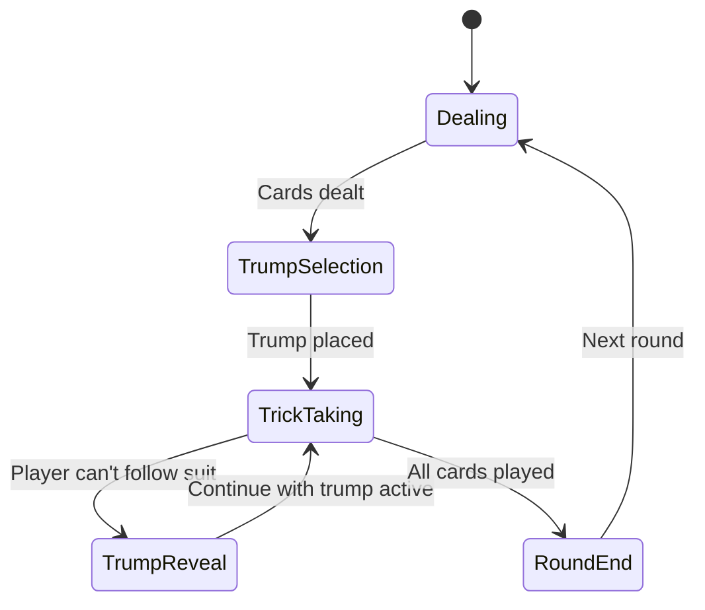

Here’s the optimized next-step prompt for Cursor to continue building Mendikot, structured for maximum technical precision:

---

**"Continue implementing Phase 2 (Gameplay Loop) with these strict requirements:**  

### **1. Trick Resolution Logic**  
```typescript
// In GameEngine.ts, implement:
function evaluateTrick(
  playedCards: {
    card: Card;
    player: Player;
  }[],
  trumpStatus: 'hidden' | { suit: Suit; revealedBy: PlayerId }
): {
  winningPlayer: PlayerId;
  capturedTens: number;
} {
  // Cursor must implement:
  // 1. If trump revealed:
  //    - Any trump card beats non-trump
  //    - Highest trump wins (Ace > King > ... > 2)
  // 2. If no trump/hidden:
  //    - Highest card of led suit wins
  // 3. Count captured 10s in this trick
  // 4. Return { winningPlayer, capturedTens }
}
```

### **2. Winning Condition Checks**  
```typescript
// Add to GameEngine.ts
function checkRoundEnd(
  gameState: GameState
): {
  winner: 'NS' | 'EW' | null;
  isMendikot: boolean;
  isWhitewash: boolean;
} {
  // Required logic:
  // - Normal win: Team with ≥3 tens
  // - Tiebreaker: Team with ≥7 tricks if 2 tens each
  // - Mendikot: All 4 tens captured
  // - Whitewash: 13 tricks won by one team
}
```

### **3. State Transitions**  


### **4. Supabase Sync Points**  
```typescript
// Critical sync events to implement:
const syncPoints = {
  TRUMP_REVEAL: `games:trump_revealed=eq.${gameId}`, 
  TRICK_END: `tricks:session_id=eq.${sessionId}:order=created_at.desc`,
  ROUND_END: `rounds:game_id=eq.${gameId}`
};
```

### **What I Need Next:**  
1. **Complete the evaluateTrick() implementation** with:  
   - Card comparison logic per Band Hukum rules  
   - Proper 10s capture tracking  
2. **Add RLS policies** for Supabase:  
   ```sql
   CREATE POLICY "trump_visibility" ON games
   USING (auth.uid() = ANY(get_players_in_game(game_id)));
   ```  
3. **Handle these edge cases**:  
   - Multiple players can't follow suit simultaneously  
   - Trump revealed on first trick lead  

**Constraints:**  
- Never allow trump suit to influence play pre-revelation  
- All state changes must sync via Supabase Realtime  
- Preserve original card ranking (Ace always high)  

**Ask me for:**  
- Which part to implement first (trick logic/sync/edge cases)  
- UI feedback requirements for trump reveal  
- Test case scenarios to validate"  
```  

This prompt gives Cursor:  
✅ **Atomic tasks** to prevent scope creep  
✅ **Code skeletons** for direct implementation  
✅ **State machine visualization** for complex flows  
✅ **Sync requirements** for multiplayer integrity  

To use:  
1. Copy-paste this exact prompt  
2. Add: *"Start with evaluateTrick() first - show me your implementation."*  
3. Request revisions if any rule deviation occurs